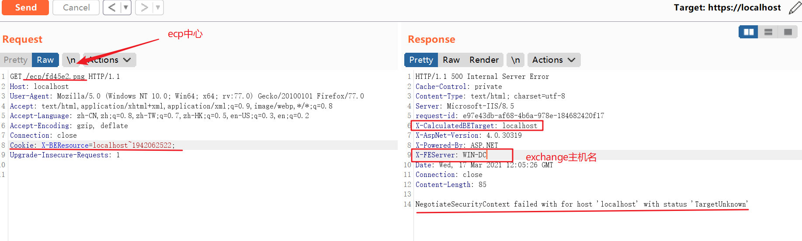
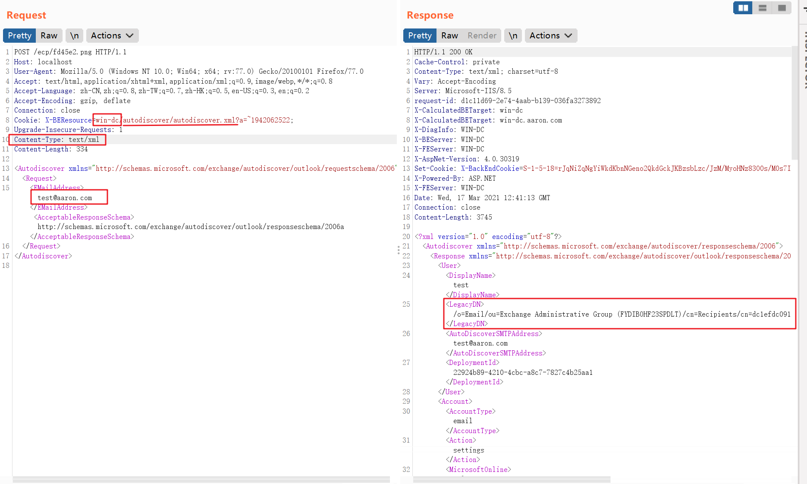
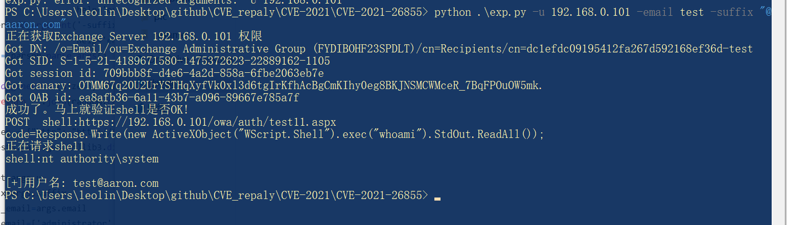

# CVE-2021-26855

又名proxylogon，是利用ssrf绕过权限验证，在结合同期的rce漏洞进行无权限rce

具体过程如下：

1、 通过SSRF漏洞攻击,访问autodiscover.xml泄露LegacyDN信息
2、 在通过LegacyDN, 获取SID
3.、然后通过合法的SID,获取exchange的有效cookie
4.、最后通过有效的cookie,对OABVirtualDirectory对象进行恶意操作，写入一句话木马，达到控制目标的效果.

#### 漏洞复现环境

win2012r2+exchange 2016cu16.iso

#### 漏洞复现

##### 漏洞探测

漏洞探测包：

ssrf原因为请求包中的cookie中X-BEResource，存在漏洞主机会有**X-FEServer和X-CalculatedBETarget**两个cookie。其中需要X-FEServer的信息进行进一步利用

##### 读取 autodiscover.xml

Autodiscover(自动发现)是自Exchange Server 2007开始推出的一项自动服务，用于自动配置用户在Outlook中邮箱的相关设置，简化用户登陆使用邮箱的流程。如果用户账户是域账户且当前位于域环境中，通过自动发现功能用户无需输入任何凭证信息即可登陆邮箱。

读取对应账户的legacyDN

##### 利用脚本

https://github.com/mai-lang-chai/Middleware-Vulnerability-detection/tree/master/Exchange/CVE-2021-26855%20Exchange%20RCE

